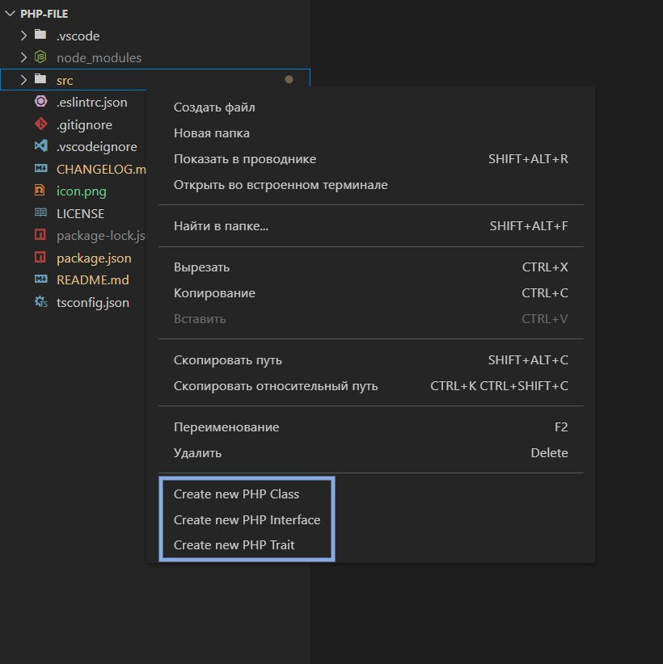

# PHP File

Extension that adds naive IDE-like file creation.



## Extension Settings

This extension contributes the following settings:

```json
// Template for PHP Class
"php-file.templates.PHPClass": [
    "<?php",
    "",
    "namespace {namespace};",
    "",
    "{use}",
    "",
    "class {name} {extends} {implements}",
    "{",
    "}"
]
```

```json
// Template for PHP Interface
"php-file.templates.PHPInterface": [
    "<?php",
    "",
    "namespace {namespace};",
    "",
    "{use}",
    "",
    "interface {name} {implements}",
    "{",
    "}"
]
```

```json
// Template for PHP Trait
"php-file.templates.PHPTrait": [
    "<?php",
    "",
    "namespace {namespace};",
    "",
    "trait {name}",
    "{",
    "}"
]
```
